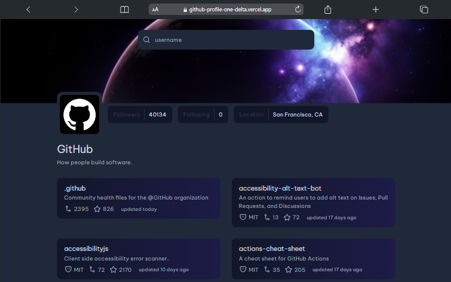

# Github Profile

## 💻 Deploy

<a href="https://github-profile-one-delta.vercel.app/">Clique aqui para ver o projeto</a>

## 📝 Descrição

O desafio "Github Profile" do Dev Challenges consiste em recriar o design fornecido e integrar com a API do GitHub para buscar e exibir informações detalhadas de usuários do GitHub. O objetivo é replicar a interface com precisão e funcionalidade, mostrando dados como repositórios, seguidores, e outras informações do perfil do usuário.

## 🔧 Instalação

Instalação com npm

```bash
  git clone "https://github.com/rogervalentim/github-profile.git"
  cd roger-valentim
  npm install
```

## 🔌 Como Rodar

```bash
  npm run dev
```

## 📊 Tecnologias e libs utilizadas

<ul>
<li>React</li>
<li>Context API</li>
<li>Tailwind Css</li>
<li>Typescript</li>
</ul>

## 📸 Imagem do projeto


